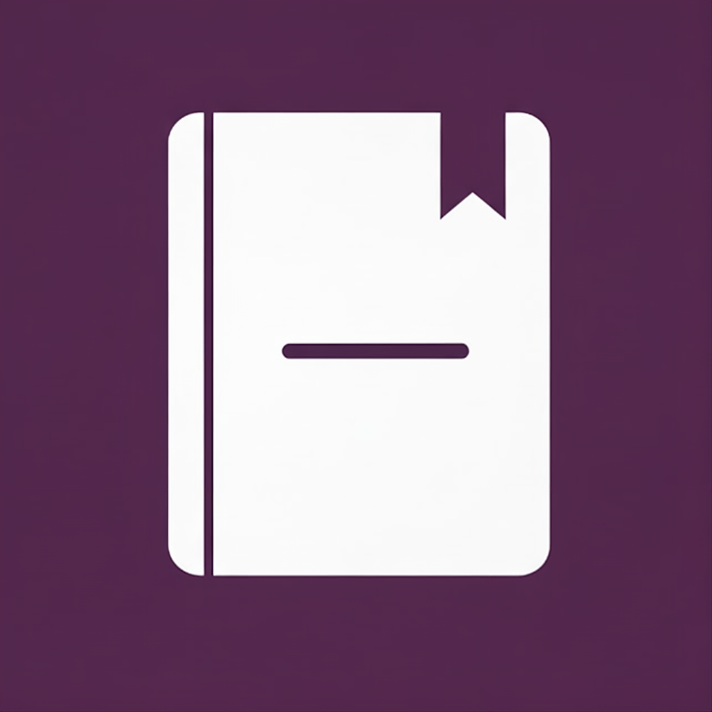

# Chronicler

  

Chronicler is a journaling macOS app I made for myself out of a little bit of frustration with Apple for not releasing a version of the iOS Journal app for its computers. Avid journalers should not have to use VSCode or Pages (yuck!)
for their entries. This quick project was also a fun way to do interesting UI work again, this time in Swfit.
  
While I don't intend to release this on the AppStore, if you're here, feel free to download for your personal use! You can open this project in Xcode, build, and run-- that should open the Chronicler app in your dock for you to enjoy! :)

